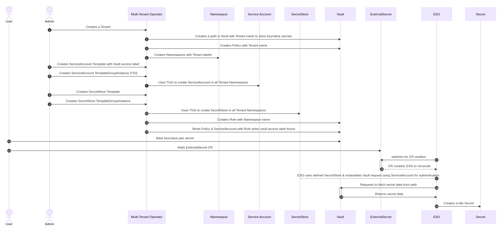
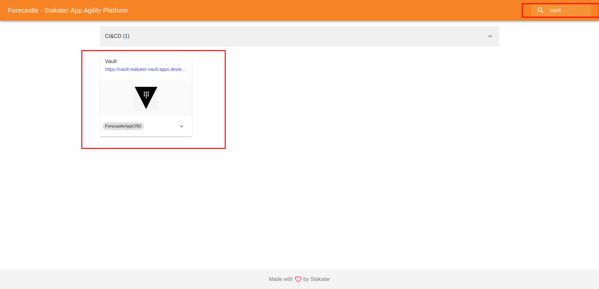
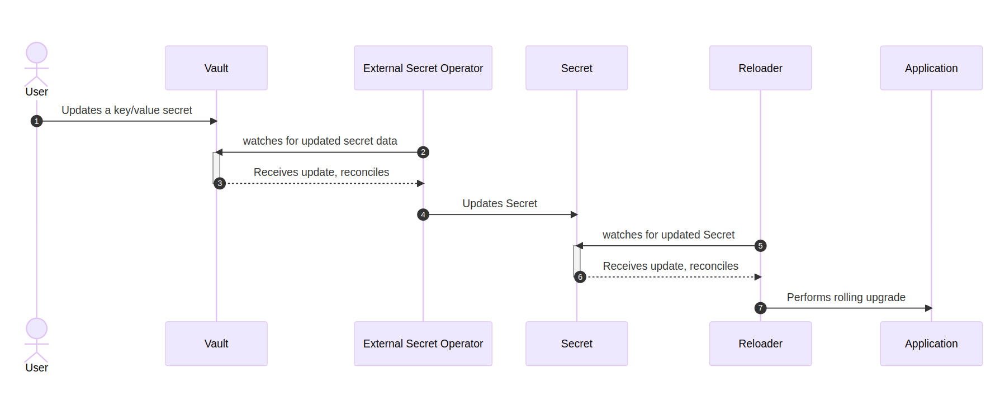
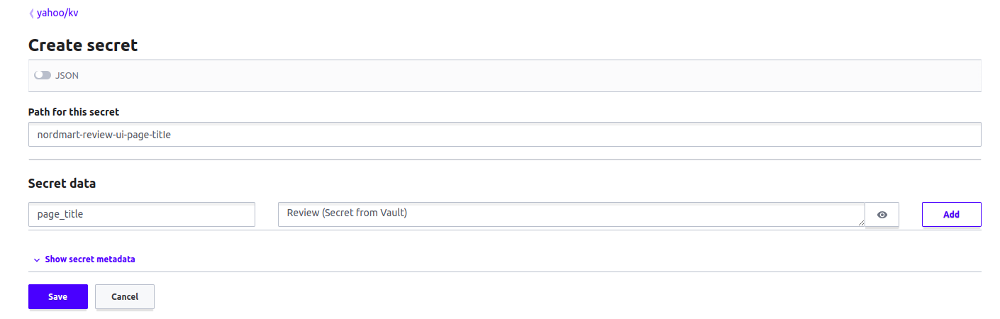
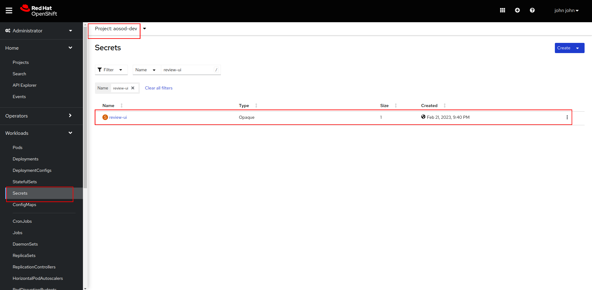
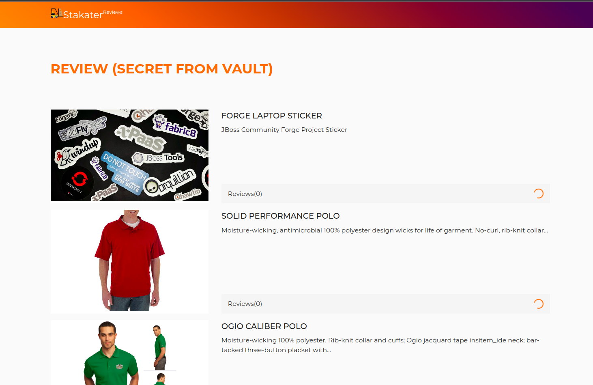
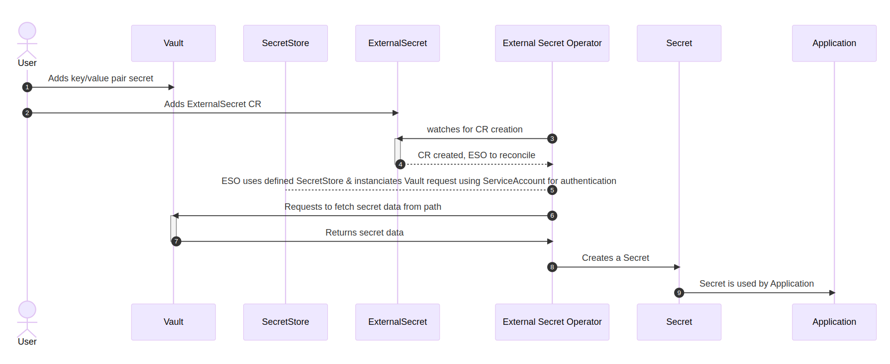
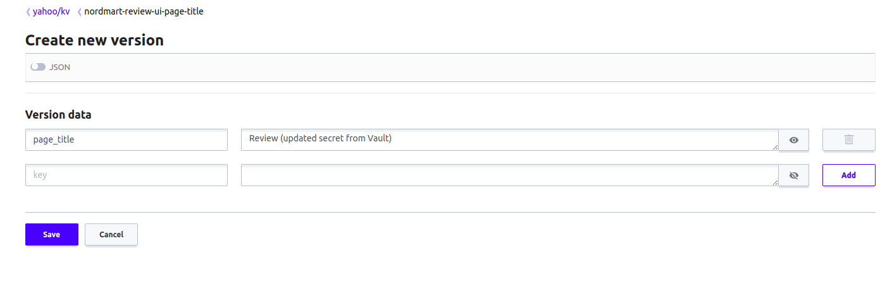
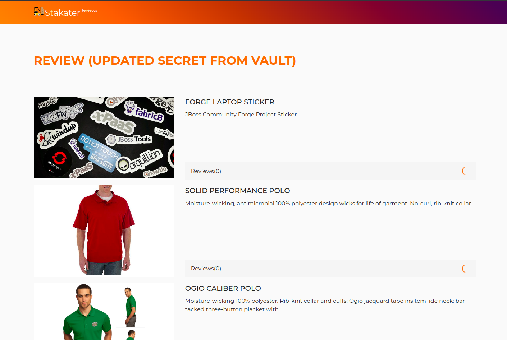
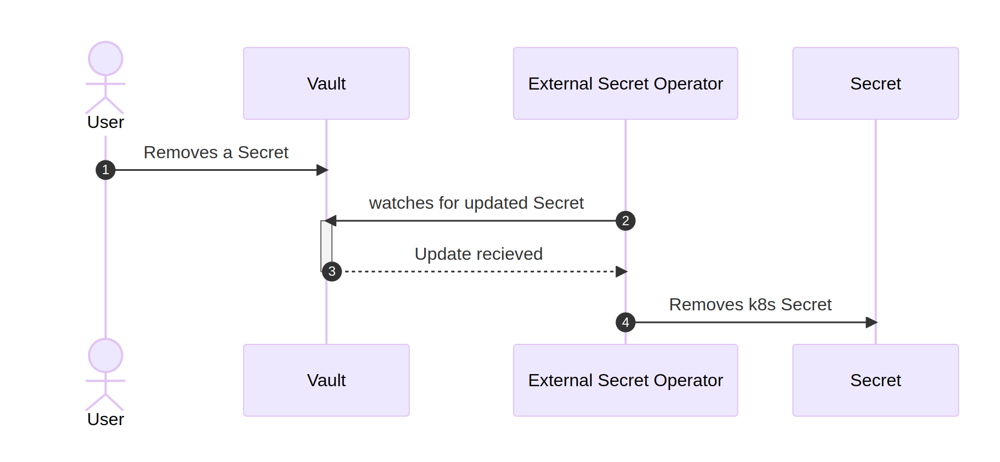

# Exercise 6 - SECRETS MANAGEMENT 

> Forecastle : https://forecastle-stakater-forecastle.apps.devtest.vxdqgl7u.kubeapp.cloud/

In this section, we will walk through secret management workflow in SAAP. 

## Backstage

Following is detailed step by step sequence diagram of MTO works together with Vault and ESO:



### Workflow

> Note: You dont have to perform this workflow. Service Account and Secret Store are already deployed

1. Administrator creates a Tenant on the cluster.
2. Multi Tenant Operator (MTO) enables a key value (kv) path for the Tenant. Login to Vault to view your tenant key value (kv) path.
   - Access Vault from  [Forecastle](https://forecastle-stakater-forecastle.apps.devtest.vxdqgl7u.kubeapp.cloud) console, search `Vault` and open the `Vault` tile.

      
   - From the drop-down menu under `Method`, select `OIDC` and click on `Sign in with OIDC Provider` and select `workshop` identity Provider

      

   - You will be brought to the `Vault` console. You should see the key value (kv) path for your tenant.

      

3. Multi Tenant Operator (MTO) creates policies with read and admin permissions for the tenant key value (kv) path.

       // Read Policy for ServiceAccounts named <TENANT_NAME>-read

       path "<TENANT_NAME>/*" {
          capabilities = ["read"]
       }
          
       // Admin Policy for Tenant Users named <TENANT_NAME>-admin

       path "<TENANT_NAME>/*" {
			capabilities = ["create", "read", "update", "delete", "list"]
        }
       path "sys/mounts/<TENANT_NAME>/*" {
            capabilities = ["create", "read", "update", "delete", "list"]
       }
       path "managed-addons/*" {
            capabilities = ["read", "list"]
       }      
4. Multi Tenant Operator (MTO) creates required Namespaces with tenant labels e.g. `stakater.com/tenant: <TENANT_NAME>`.

5. Admin creates a Template that contains a Service Account. This Service Account is used by Secret Store to access Vault. Notice the label `stakater.com/vault-access: "true"`.

         apiVersion: tenantoperator.stakater.com/v1alpha1
         kind: Template
         metadata:
           name: <TENANT_NAME>-vault-access
         resources:
            manifests:
            -  kind: ServiceAccount
               apiVersion: v1
               metadata:
                  name: tenant-vault-access
                  labels:
                    stakater.com/vault-access: "true"
         
   More Info on Template: https://docs.cloud.stakater.com/content/sre/multi-tenant-operator/usecases/template.html

6. Admin creates a TemplateGroupInstance which deploys Template (containing Service Account) to namespaces based on selector. We specify tenant label `stakater.com/tenant` in selector. This will deploy ServiceAccount in tenant namespaces. This ServiceAccount is required by SecretStore to access Vault.

         apiVersion: tenantoperator.stakater.com/v1alpha1
         kind: TemplateGroupInstance
         metadata:
         name: <TENANT_NAME>-vault-access
         spec:
            selector:
               matchExpressions:
               - key: stakater.com/kind
                  operator: In
                  values:
                     - <TENANT_NAME>
            sync: true
            template: <TENANT_NAME>-vault-access

   More Info on TemplateGroupInstance : https://docs.cloud.stakater.com/content/sre/multi-tenant-operator/usecases/deploying-templates.html
   
7. Multi Tenant Operator (MTO) deploys the Template resources to selector defined in TemplateGroupInstance.

8. Admin creates a Template that contains a Secret Store (External Secret CR). The SecretStore is namespaced and specifies how to access the external API which is Vault. Templates are used to share resources among namespaces.

         apiVersion: tenantoperator.stakater.com/v1alpha1
         kind: Template
         metadata:
         name: <TENANT_NAME>-vault-secret-store
         resources:
         manifests:
         - apiVersion: external-secrets.io/v1alpha1
            kind: SecretStore
            metadata:
               name: tenant-vault-secret-store
            spec:
               provider:
                 vault:
                  server: "http://vault.stakater-vault:8200"
                  path: "<TENANT_NAME>/kv"
                  version: "v2"
                  auth:
                     kubernetes:
                       mountPath: "kubernetes"
                       role: "${namespace}"
                       serviceAccountRef:
                         name: "tenant-vault-access"

   More Info on Secret Store: https://external-secrets.io/v0.5.7/api-secretstore/  
   More Info on Template: https://docs.cloud.stakater.com/content/sre/multi-tenant-operator/usecases/template.html

9. Admin creates a TemplateGroupInstance which deploys Template (containing SecretStore) to namespaces based on selector. We specify tenant label `stakater.com/kind` in selector. This will deploy SecretStore in tenant namespaces.

         apiVersion: tenantoperator.stakater.com/v1alpha1
         kind: TemplateGroupInstance
         metadata:
         name: <TENANT_NAME>-vault-secret-store
         spec:
         selector:
            matchExpressions:
            -  key: stakater.com/kind
               operator: In
               values:
                  - <TENANT_NAME>
         sync: true
         template: <TENANT_NAME>-vault-secret-store

   More Info on TemplateGroupInstance : https://docs.cloud.stakater.com/content/sre/multi-tenant-operator/usecases/deploying-templates.html

10. Multi Tenant Operator (MTO) deploys the Template resources to tenant namespaces based on selector defined in TemplateGroupInstance.

11. Multi Tenant Operator (MTO) creates a role in Vault with namespace name.  

12. Multi Tenant Operator (MTO) binds Service Account (with `stakater.com/vault-access: 'true'` label) and Policy with Role. Later, External Secrets Operator uses this Service Account to instantiate request to Vault for secret data.

<b>Note</b>: Point 13 onwards are explained in next workflow.

> Forecastle : https://forecastle-stakater-forecastle.apps.devtest.vxdqgl7u.kubeapp.cloud/

## Creating Secrets



   ### Workflow 

   1. User adds a Key/Value pair secret data to a path in Vault.
   
      - In the path of your tenant, Click `Create Secret`, add path of secret, and add key-value pair as shown below.

         - Path for secret: `nordmart-review-ui-page-title`
         - Secret key: `page_title`
         - Secret value: `Review (Secret from Vault)`

  

   2. Add ExternalSecret CR

      - In your DevWorkspace, open `stakater-nordmart-review-ui` project
      - Navigate to `deploy` folder & open `templates` folder
      - Create a new file and name it `external-secret.yaml`
      - Paste the following yaml in this file and save it.

      ```yaml
      apiVersion: external-secrets.io/v1alpha1
      kind: ExternalSecret
      metadata:
        name: review-ui-secret
        namespace: <TENANT_NAME>-dev
      spec:
        secretStoreRef:
          kind: SecretStore
          name: tenant-vault-secret-store
        refreshInterval: "1m"
        target:
          name: review-ui
          creationPolicy: 'Owner'
          template:
            type: Opaque
        dataFrom:
          - key: nordmart-review-ui-page-title

      ```

      - Run the following command again to deploy ExternalSecret CR

      `helm template deploy/ -n <TENANT>-dev | oc apply -f -`

   3. External Secrets Operator (ESO) watches for ExternalSecret CR creation.

   4. When a new CR is created, External Secrets Operator (ESO) reconciles it from the provided spec.

   5. External Secrets Operator (ESO) uses the defined SecretStore from ExternalSecret CR and instantiates Vault request using ServiceAccount created, and bound to Vault role, to authenticate to Vault. 

      ```
      secretStoreRef:
         kind: SecretStore
         name: tenant-vault-secret-store     
      ```

   6. External Secrets Operator (ESO) requests to fetch secret data from the path specified in ExternalSecret CR.

      ```
         dataFrom:
            - key: nordmart-review-ui-page-title
      ```

   7. Vault returns the requested secret data to External Secrets Operator (ESO).

   8. External Secrets Operator (ESO) creates a Kubernetes Secret. 

   9. Navigate to `Workloads > Secrets` on openshift console and search for the secret created above.

      

   9. Secret is consumed by the Application. Following are the steps to add the secret as environment variable to your application.

      - In your DevWorkspace, open stakater-nordmart-review-ui repository code, and navigate to deploy folder.
      - Open and edit values.yaml
      - Add the following yaml under `deployment.env`, this adds an environment variable to the deployment. 

         ```yaml
               PAGE_TITLE:
                  valueFrom:
                     secretKeyRef:
                       name: review-ui
                       key: page_title
         ```
      - Save the file. In your terminal, run this command again to deploy application with updated configuration for environment variable:
      
      ```
       helm template deploy/ -n <TENANT>-dev | oc apply -f -
      ```
      - Application pod will be recreated. Refresh the application route to see the change. The title will be updated!

      


## Updating Secrets



   ### Workflow

   1. User modifies the secret data in Vault.

      - Open your secret path and click on <b>Create new version</b>
         - Secret key: `page_title`
         - Secret value: `Review (updated secret from Vault)`

      - Update the secret value as shown below and click <b>Save</b>.

      

   2. External Secrets Operator (ESO) polls the Vault API for update after a defined time interval. This time interval is defined in the ExternalSecret CR created previously. 

      ```
         refreshInterval: "1m"
      ```

   3. External Secrets Operator (ESO) receives the update and starts reconciliation.

   4. External Secrets Operator (ESO) updates the values of Kubernetes Secret with the new values user just added in Vault.

   5. Stakater Reloader is continously watching the Kubernetes Secret for change.

   6. It receives the update instantly.

   7. Stakater Reloader performs a rolling upgrade on Kubernetes resource(s). Application is up again with the updated secret values in no time! 

      

## Deprecating Secrets



   ### Workflow

   1. User removes secret from path in Vault.

   3. External Secrets Operator (ESO) receives the update and starts reconciliation.

   4. External Secrets Operator (ESO) uses defined deletion policy from ExternalSecret CR to either retain or delete the Kubernetes Secret.

      - If deletion policy is set to `Retain`, Kubernetes Secret will not be deleted even after secret data on the defined path is removed from Vault.
      - If deletion policy is set to `Delete`, Kubernetes Secret will be deleted and application will fall back to using default values.  

