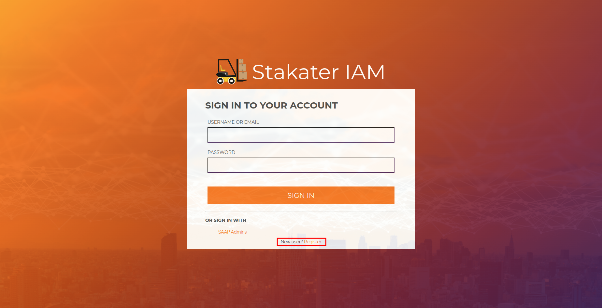
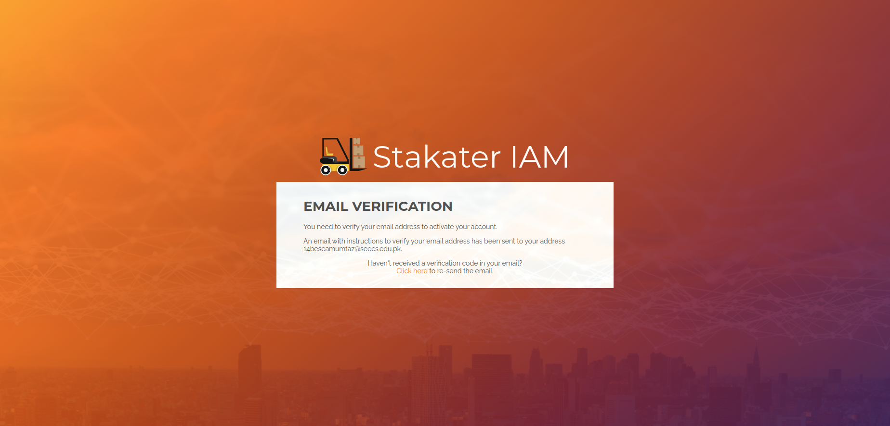
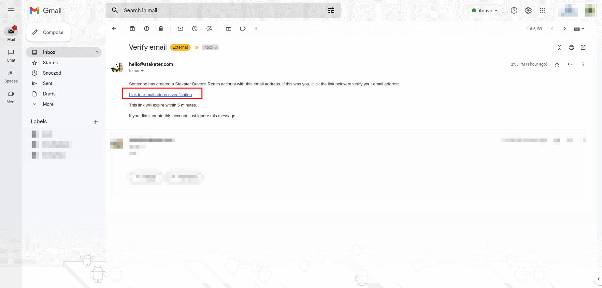

# OUR SETUP

_TODO_

SAAP - Stakater App Agility Platform is Kubernetes based fully managed DevSecOps platform on cloud of your choice for teams so, they can focus on their product!

SAAP enables developers to control and configure the entire cloud development loop in order to ship software faster!

We will register our SAAP user in the following section.

# Setting up your account

1. To register your user, open the SAAP login page

2. Select Register User from the above menu. This will redirect you to the registration form.

3. Fill in the form with required details and hit Register. 

   *Note* Use your professional email for registration

4. Once you hit enter, the following screen will be shown, and you will a verification email will be sent to you on the email address you used in step 3.

5. Use the link provided in the email to verify your user.
   /home/asfa/Downloads/verification.png

6. Once you've verified your user, you will be redirected to SAAP. 
SAAP will then configure some things for you behind the scenes. Brief explanation of these configuration are provided in the following sections.

## Tenant creation 

Once you've verified your user, a tenant bearing the name of organization will be created on SAAP.

*_Tenant_* is a concept used by Multi Tenant Operator. For the sake of simplicity you can think of tenant as an isolation between different teams, but it can do much more than that. You can read more about Multi Tenant Operator here.

If you now go to the projects page of SAAP, you will start seeing three projects:
* [ORGANIZATION]-dev
* [ORGANIZATION]-[YOUR-NAME]-sandbox  
* devworkspace-operator

For now, let's ignore the devworkspace-operator namespace and look at the other two.

[ORGANIZATION]-[YOUR-NAME]-sandbox project:
As the name suggest, this is playground namespace/project for the users in a tenant. Every user belonging to a tenant will have his/her own sandbox

[ORGANIZATION]-dev
This is the namespace in which we will be deploying our demo app in section 3. For now, this will be empty

## Tenant-Vault Integration

* Tenant vault access enabled
* Path created in vault for adding secrets
* OIDC configured as a login mechanism

## Gitlab Automation 

* Added group
* Cloned projects
* Added gitops repo
_TODO_

## Devworkspace Creation

When you registered your user, we also configured a devworkspace for you. 
The devworkspace will act and as IDE for you. It provides  consistent, secure, and zero-configuration development environment. You will learn more about devworkspace in the next section.
We have already linked the projects added in Gitlab to your devworkspace. More on this later!!!
[add-image]

## Argocd Application

* Apps of apps for gitops repo
 _TODO_
